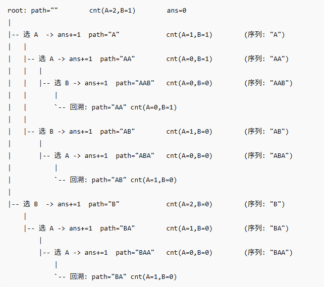

restate

We’re given a string of letter tiles, and we can form sequences by choosing any subset of tiles and arranging them.

Each tile can be used at most once. We need to return how many **distinct non-empty** sequences we can form.”

给定一串字母方块，我们可以从中选择任意一个方块子集并重新排列，从而组成序列。

每个方块最多只能使用一次。我们需要计算可以组成多少个不同的非空序列。

Clarify Constraints , I want to confirm a few details:

The input length up to 7 tiles.)

Duplicates are allowed, like ‘AAB’.允许重复，例如“AAB”。

We only count **unique** sequences, not permutations with the same letters.

我们只统计不同的序列，不统计包含相同字母的排列组合。

We return the **count** only, not the sequences themselves.”我们只返回计数 ，不返回序列本身。

## Baseline Solution

A straightforward approach is to generate all permutations of all lengths from 1 to n, put them into a set, and then return the set size.“

一种直接的方法是生成从 1 到 n 的所有长度的所有排列，将它们放入一个集合中，然后返回集合的大小。

But this creates lots of duplicates when there are repeated letters, and using a set of strings is memory-heavy. Even though n is small, we can do better and avoid generating duplicate strings.”但是，当字母重复时，这种方法会产生大量重复项，而且使用字符串集合会占用大量内存。即使 n 很小，我们也可以做得更好，避免生成重复字符串。

- “I use a frequency counter instead of permuting indices, because duplicates come from repeated letters.”“我使用频率计数器而不是排列索引，因为重复项来自重复的字母。”
- “In DFS, I try each character whose count is still positive.”“在深度优先搜索中，我会尝试每个计数仍然为正的角色。”
- “Once I pick a character, that immediately forms a new non-empty sequence, so I do `ans += 1`.”“一旦我选择一个字符，它就会立即形成一个新的非空序列，所以我执行 ans += 1 ”
- “Then I decrement its count, recurse to extend the sequence, and finally restore the count to backtrack.”“然后我减去它的计数，递归地扩展序列，最后恢复计数以回溯。”
- “This avoids duplicates naturally because identical tiles are treated as the same choice.”“这样自然就能避免重复，因为相同的图块会被视为相同的选择。”

**Time complexity:**

Best case ≈ O(n) "AAAAAAA"

A
AA
AAA
...
AAAAAAA , n 种序列

Time complexity is exponential in the worst case, roughly O(n!),

because we explore all possible permutations of the tiles.所有可能的排列组合。

Since n is at most 7, this is totally manageable.”由于 n 至多为 7，所以这完全可以处理。

**Space complexity:**

- **O(m + n)** : `Counter` is **O(m)** , recursion depth is at most **O(n)** .
- No set of strings is stored, so memory is small.

## Complexity

“Time is proportional to the number of unique sequences we generate.

With n ≤ 7, it’s totally feasible.

所需时间与我们生成的唯一序列的数量成正比。当 n ≤ 7 时，这是完全可行的。”

Space is O(1) extra besides recursion depth O(n), since the frequency array size is fixed (26).”除了递归深度 O(n) 之外，空间复杂度 O(1) 也是额外的，因为频率数组的大小是固定的 (26)。
