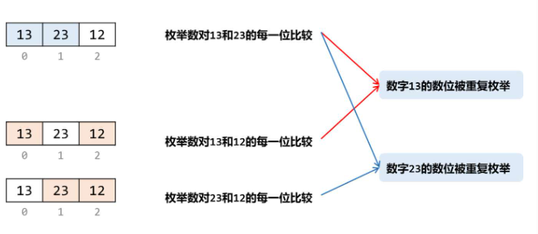
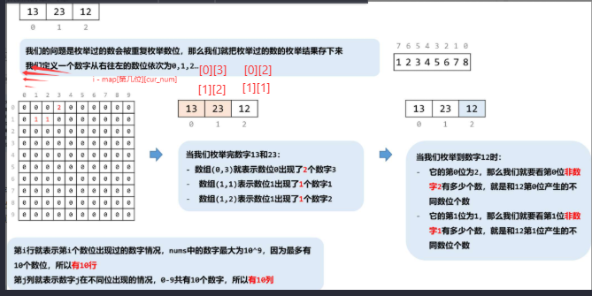

“Let me restate the problem in my own words to make sure I understand it correctly.
We’re given an array of integers nums. For every pair (i, j) with i < j, we compare nums[i] and nums[j] digit by digit (same digit positions), count how many positions are different, and sum that over all pairs. We need to return that total.”
✅ 1) Clarify Constraints (30–60 sec)
“Before jumping into solutions, I’d like to clarify a few constraints.”
“Do all numbers have the same number of digits?” (In this LeetCode problem, yes—this is the key.)
“How large can n be? Could it be up to 1e5?”
“Any leading zeros?” (Usually no, but if digit-length is guaranteed equal, we’re fine.)
✅ 3) Baseline Solution (30–60 sec)
“A straightforward approach would be brute force:
for each pair of numbers, convert to strings and compare each digit position.”
Time: there are O(n^2) pairs, each comparison costs O(L) digits
Total: O(n² · L)
“However, this doesn’t scale well if n is large.”

https://leetcode.cn/problems/sum-of-digit-differences-of-all-pairs/solutions/2897699/javapython3cha-xi-biao-tong-ji-mei-yi-we-rgao/

